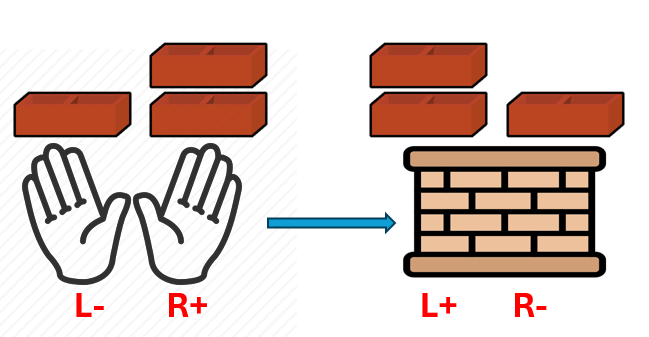

# [22. Generate Parentheses](https://leetcode.com/problems/generate-parentheses/description/)


Given `n` pairs of parentheses, write a function to generate all combinations of well-formed parentheses.

 
 ```java
Example 1:

Input: n = 3
Output: ["((()))","(()())","(())()","()(())","()()()"]
Example 2:

Input: n = 1
Output: ["()"]
 

Constraints:

1 <= n <= 8

```



## Solution 1: DFS + Pruning 
[Submission](https://leetcode.com/problems/generate-parentheses/submissions/1669752198/)

### Idea
- Stop when full
- Left if you can
- Right if legal

```java
class Solution {
    public List<String> generateParenthesis(int n) {
        char[] chars = new char[n*2];
        List<String> result = new ArrayList<>();
        generateParenthesis(chars, 0, n, n, result);
        return result;
    }

    private void generateParenthesis(char[] chars, int charIndex, int left, int right, List<String> result){
        if (left == 0 && right == 0){
            result.add(new String(chars));
            return;
        }

        if (left > 0){
            chars[charIndex] = '(';
            generateParenthesis(chars, charIndex + 1, left - 1, right, result);            
        }

        if (left < right){
            chars[charIndex] = ')';
            generateParenthesis(chars, charIndex + 1, left, right -1, result);
        }
    }    

}
```


